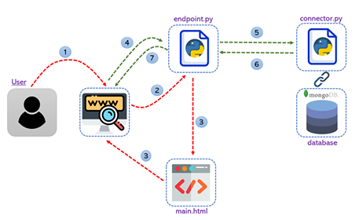

# Design-4-Green2018

Challenge of eco-design. 48 hours non stop challange from November 21 to 23 2018.

## Built With

- HTML
- CSS
- Python 2.7
- Java Script
- Flask 1.0.2
- MongoDB 3.2.11

## Description
The solution to the design challenge is composed of one html page with a survey, which content is provided by the challenge organizators. A user is given an opportunity to save answers and share the questionnaire using a generated link.  

## Architecture 



1. User sends accesses the website
2. The GET request is sent to the Flask server. The functionality is developed in ```endpoint.py```.
3. ```main.html``` file is passed to the user.
4-6. Upon loading ```main.html``` the server pulls questions from MongoDB.
7. The updated html file is shown to the user

## API

| Endpoint address        | Parameters | Content type | Response type |     Method    |
| --------------------    | ------------- | ------------- | ------------- | ---------- |
| /                       |               |                  |  html            | GET  |
| /getAllBasicQuestions   |               | application/json | application/json | POST |
| /saveAllAnswers         | answers       | application/json | application/json | POST |
| /pauseAnswering         | answers       | application/json | application/json | POST |
| /continue               | id            | application/json | application/json | POST |
| /generate               |               |                  | file             | POST |

## Authors

- **Anastasiia Grishina**
- **Maliha Rahman Mishi**
- **Krishna Teja Vaddepalli**
- **Sami Kabir**
- **Feruzjon Muyassarov**
